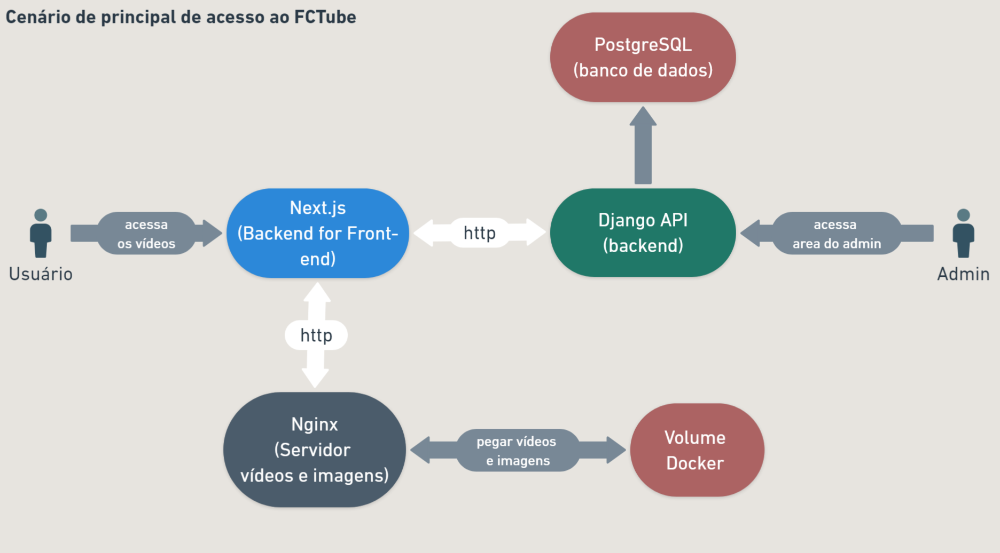
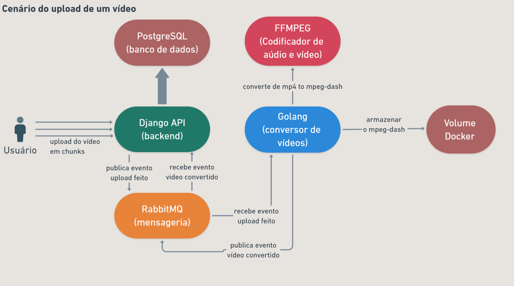
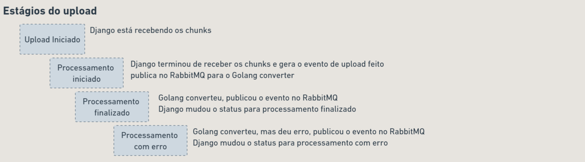
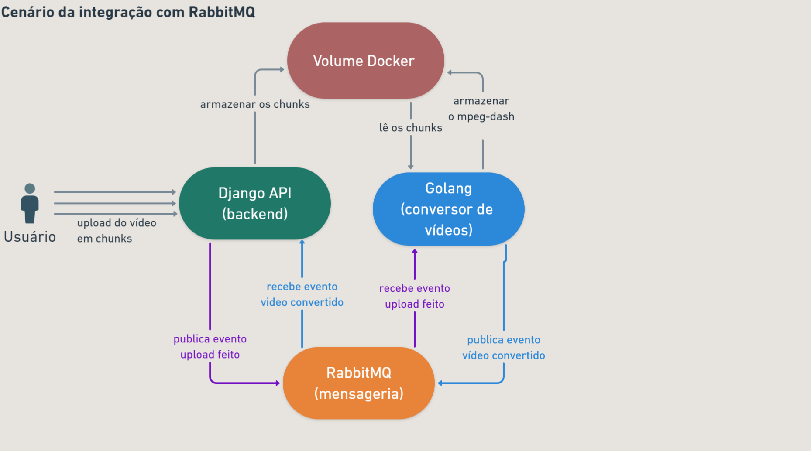
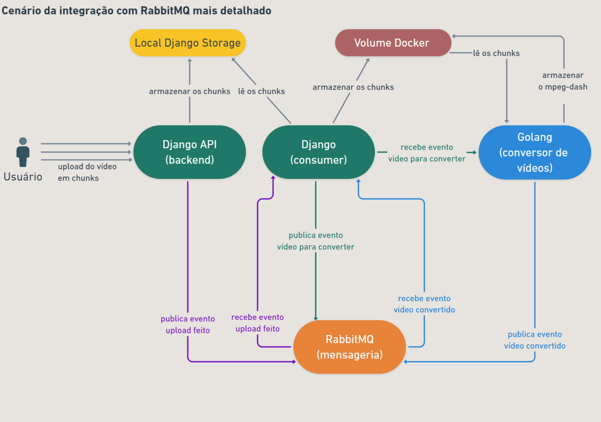

## Sobre
Projeto é um MVP de uma plataforma de streaming de videos no mesmo estilo do Youtube.

Aplicação feita seguindo as videoaulas da imersão do canal [Full Cycle](https://www.youtube.com/@FullCycle).

## Requerimentos

Cada projeto tem seus próprios requerimentos, mas uma ferramenta é comum a todos: o Docker.

## Rodar a aplicação

Rode todas as aplicações com o comando:
    
```bash
docker-compose up -d
```

Este comando irá subir todos os containers necessários para rodar todo o projeto

Acesse as pastas `golang`, `django` e `nextjs` e siga as instruções.


## Arquitetura do projeto




